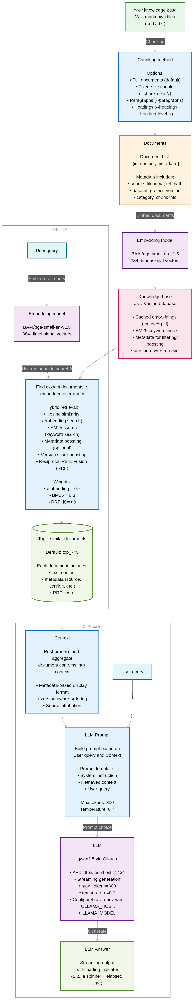

# Hybrid RAG System

A Retrieval-Augmented Generation system that combines semantic search (embeddings) with keyword search (BM25) to retrieve relevant document context and generate answers using a local LLM via Ollama.

## RAG Workflow



## Features

- **Hybrid retrieval** — Embedding-based (cosine similarity) + BM25 keyword search fused via Reciprocal Rank Fusion
- **Multiple chunking strategies** — Full documents, paragraphs, heading-based, or fixed-size chunks
- **Version-aware retrieval** — Automatic version detection and score boosting when multiple dataset versions are loaded
- **Metadata-based boosting** — Optional filename matching boost for navigational queries
- **Streaming output** — Token-by-token LLM generation with loading indicator
- **Local, private** — Runs entirely locally with Ollama and sentence-transformers

## Requirements

### Prerequisites

- **Python 3.14+**
- **Ollama** running locally (default: http://localhost:11434)
- **qwen2.5** model loaded in Ollama (or configure via `OLLAMA_MODEL` env var)

### Dependencies

The project uses [uv](https://github.com/astral-sh/uv) for dependency management. All required packages are defined in `pyproject.toml`:

- `numpy>=2.4.4`
- `ollama>=0.6.1`
- `rank-bm25>=0.2.2`
- `sentence-transformers>=5.3.0`

### Setup

Install all dependencies
```bash
uv sync
```

This creates a virtual environment and installs all dependencies automatically.

## Command Line Interface

### Usage

```python
python main.py <folder> [OPTIONS]
```

| Option             | Description                                   |
| ------------------ | --------------------------------------------- |
| `--paragraphs`     | Split documents into paragraphs (recommended) |
| `--headings`       | Split documents by markdown headings          |
| `--chunk-size N`   | Split into N-character chunks                 |
| `--top-k N`        | Documents to retrieve (default: 5)            |
| `--metadata-boost` | Enable filename-based score boosting          |
| `--version VER`    | Boost a specific version (e.g., `v52`)        |
| `--max-docs N`     | Limit source documents loaded                 |

### Examples

```bash
# Basic usage
python main.py path/to/your/wiki/

# Paragraph-level retrieval (recommended for large docs)
python main.py path/to/your/wiki/ --paragraphs --top-k 3

# Multi-dataset with metadata boosting
python main.py path/to/wiki-datasets/ --paragraphs --metadata-boost

# Boost an older version explicitly
python main.py path/to/wiki-datasets/ --paragraphs --version v1
```

## Architecture

The system uses a dual-path retrieval approach:

1. **Embedding search** — BAAI/bge-small-en-v1.5 (384-dim) with cached embeddings
2. **BM25 keyword search** — With configurable K1/B parameters
3. **Reciprocal Rank Fusion** — Weights: 0.7 embedding + 0.3 BM25, k=60

See [src/architecture.md](architecture.md) for the full technical documentation.
